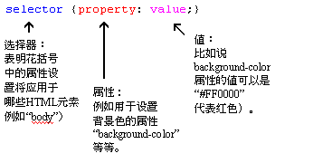
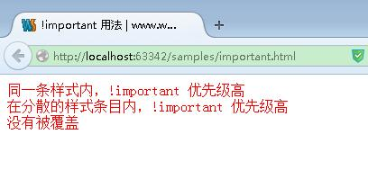

介绍
====

## 什么是CSS
CSS 是 Cascading Style Sheet（层叠样式表）的缩写。是用于（增强）控制网页样式并允许将样式信息与网页内容分离的一种标记性语言。CSS 不需要编译,可以直接由浏览器执行(属于浏览器解释型语言)。

CSS2.1 是目前被使用最广泛的版本，而目前还在开发中的 CSS3 具有更吸引人的特性。

CSS3 已完全向后兼容，所以你就不必改变现有的设计。

## 语法

selector {property: value;}

## 用法

### 引入方式

三种方式将样式表加入您的网页：

#### 内联方式 Inline Styles

内联定义即是在对象的标记内使用对象的 style 属性定义适用其的样式表属性。
示例代码：

	
这一行的字体颜色将显示为红色

#### 内部样式块对象 Embedding a Style Block

你可以在你的 HTML 文档的`<head>`标记里插入一个`

#### 外部样式表 Linking to a Style Sheet

你可以先建立外部样式表文件`*.css`，然后使用 HTML 的 link 对象。或者使用 `@import` 来引入。
示例代码：

	<!-- Use link elements -->
	<link rel="stylesheet" href="core.css">
	
	<!-- Use @imports -->
	

**注意**：在实际开发中，推荐使用 HTML 的 link 对象来引入。详细内容可以参见<http://www.waylau.com/css-code-guide/#css-miscellaneous>

### 优先级

而最接近目标的样式定义优先权越高。高优先权样式将继承低优先权样式的未重叠定义但覆盖重叠的定义。例外请参阅!important声明。

####!important

!important 作用是提高指定 CSS 样式规则的应用优先权。

	<!DOCTYPE html>
	<html>
	<head>
	    <meta charset="utf-8">
	    <title>!important 用法 | www.waylau.com</title>
	    <meta name="description" content="!important 用法">
	    <meta name="author" content="Way Lau, www.waylau.com"/>
	    <meta name="viewport" content="width=device-width">
	    <link rel="shortcut icon" href="/favicon.ico">
	
	    
	</head>
	<body>
	
同一条样式内，!important 优先级高

	
在分散的样式条目内，!important 优先级高

	
没有被覆盖

	</body>
	</html>

详细的可以参见 [CSS 的优先级机制[总结]](http://www.cnblogs.com/xugang/archive/2010/09/24/1833760.html)